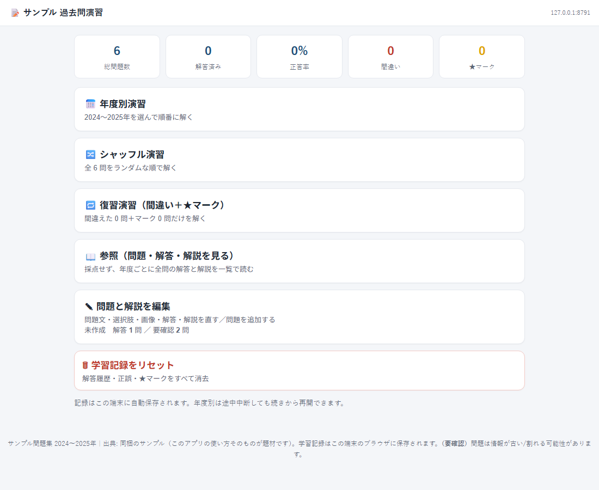
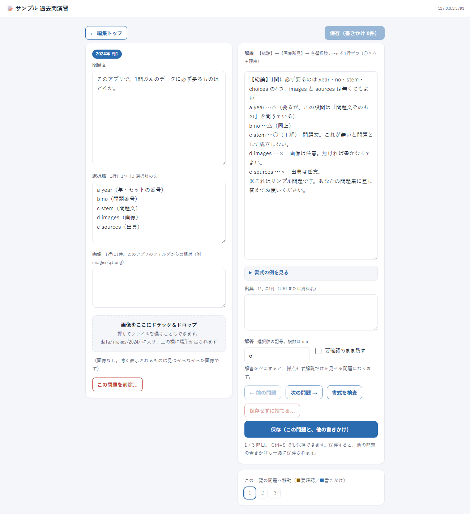

# 過去問練習アプリ(exam-drill)

手元の過去問を、自分で解きながら「解説つきの問題集」に育てていくためのシングルユーザー向けWebアプリです。年ごとの演習・シャッフル出題・まちがい復習が付いていて、答えと解説はアプリの画面の中で書き足せます。



- **ローカル完結**: データはすべて自分のPCの中(`data/` フォルダ)。クラウドへの送信はありません
- **依存ゼロ**: Python の標準ライブラリだけで動きます(追加インストール・ビルド不要)
- **答えが無い状態から始められる**: 問題文と選択肢だけ先に入れて、解きながら答えと解説を埋めていけます
- **問題も解説もアプリの中で書ける**: 問題文・選択肢・画像・解答・解説・出典を画面から編集し、保存すればすぐ演習に出ます
- **画像はドラッグ＆ドロップ**: 編集画面に落とすと `data/images/<年>/` に入り、その問題の画像欄に足されます。ファイル名の先頭の数字で一括して割り当てることもできます
- **選択肢のない問題も**: 自分で書いて答える問題集も作れます(採点せず「模範解答を見る」で解説を開く)
- **スマホ対応**: [Tailscale](https://tailscale.com/) を使えばスマホやタブレットからも同じ画面が使えます(オプション。PCだけでも全機能動作)
- **中身は入っていません**: サンプル数問だけです。あなたの問題に差し替えて使ってください

Windows と macOS の両方で動作を確認済みです(macOS 26.5.1 / Apple Silicon で実機検証)。

想定しているのは、こういう状況です。

> 過去問のPDFはある。**でも解答は付いていない。**
> 解きながら答えを調べて、自分の言葉で解説を書き足していきたい。

1. PDFから**問題文と選択肢だけ**取り出して、テキストに書く(画像もあれば添える)
2. アプリに取り込む。**答えは空のままでかまいません**
3. 演習で解く。調べて分かったら、その場で**答えと解説を書き足す**
4. 編集画面に「**未作成の解答 ○問**」「**未作成の解説 ○問**」が出るので、残りが一目で分かります

資格試験でも語学でも、自分の資料があればそのまま使えます。

## 必要環境

- **Python 3.9 以降**(標準ライブラリのみ。パッケージのインストールは不要です)
- ブラウザ(Chrome / Edge / Safari / Firefox)
- Windows / macOS / Linux

Python が入っているかは、ターミナル(Windowsならコマンドプロンプト)で `python3 --version`
または `python --version` を実行すると分かります。無ければ
[python.org](https://www.python.org/downloads/) から入れてください。

## 入手方法

```
git clone https://github.com/m-higashi/exam-drill.git
cd exam-drill
```

ZIPでダウンロードしても同じです(Code → Download ZIP)。
**Safari では自動で展開される**ので、`.zip` は残りません(そのまま使えます)。

## 起動

フォルダの中の起動スクリプトをダブルクリックするだけです。

- **Windows**: `start.bat`
- **macOS / Linux**: `start.command`

黒い画面にURLが出るので、ブラウザで開いてください。**この画面は開いたままにしてください**
(閉じるとサーバーが止まります)。

**画面に出たアドレスをそのまま使ってください。** 待受け先を空欄にしたままだと、
Tailscale が入っている環境では `100.x.y.z` にだけ待ち受けるので、`127.0.0.1` では開けません。

### macOS で最初につまずきやすいところ

詳しくは [使い方.txt](使い方.txt) にあります。

- ⛔ **開こうとすると警告が出て開けない** — ダウンロードしたものを最初に開くと出ます。
  **文言は macOS の版によって変わります。**次のどちらか(似た文)が出れば、同じことです。

  > **"start.command" は開いていません**
  > Apple は、"start.command" に Mac に損害を与えたり、プライバシーを
  > 侵害する可能性のあるマルウェアが含まれていないことを検証できませんでした。
  > ［ゴミ箱に入れる］　［完了］

  > **"start.command" は、開発元を確認できないため開けません。**
  > ［ゴミ箱に入れる］　［キャンセル］

  **⚠️どちらの画面でも「ゴミ箱に入れる」が既定のボタン(青)です。**
  **Enter を押すとアプリが消えます。「完了」または「キャンセル」を押してください。**

  そのうえで、次の手順で開けます。

  1. **システム設定 → プライバシーとセキュリティ → セキュリティ欄の「このまま開く」**
  2. 管理者の Touch ID(またはパスワード)で認証

  macOS 15 以降は「右クリック → 開く」は効きません(それ以前の版では効きます)
- **`permission denied`** — 一度だけ `chmod +x start.command`
- **`Operation not permitted`** — ダウンロード／デスクトップ／書類フォルダは macOS の保護が掛かります。
  ホームフォルダ直下など、保護の無い場所に置いてください

## 自分の問題を入れる

やり方は3通りあります。どれでも同じ結果になります。

**① メモ帳で書いたテキストから取り込む**(まとまった数があるならこれ)

「✎ 問題と解説を編集」→「📄 まとめてテキストから取り込む」で、ファイルを選ぶか貼り付けます。
**「読み取って確認する」→「追加する」の2段**で、確認の段階では何も書き換わりません。
何行目で何が起きたかを教えるので、直しながら進められます。

**答えが分からなければ、`答え:` の行は書かなくてかまいません。**
問題文と選択肢だけ先に入れておき、解きながら埋めていけます。

```
2024

問1
問題文をここに書きます。
a 選択肢その1
b 選択肢その2
c 選択肢その3

問2
答えが分かっているものは、こう書きます。
a 選択肢その1
b 選択肢その2
答え: b
解説:
【総論】ここに解説を書きます。
a …×　違う理由。
b …○（正解）
```

実例は同梱の `data/sample.txt`(アプリの「書き方の見本を入れる」でも読めます)。
文字コードは UTF-8 / UTF-16 / Shift_JIS を自動で見分けます。
決まりは **[データ形式.md](データ形式.md)** に一覧があります。

**② アプリの中で1問ずつ書く**

「✎ 問題と解説を編集」→「問題を追加する」。問題文・選択肢・解答・解説を書いて「保存」。

**③ JSONを直接書く**

`data/sample.json` を差し替えます。形は [データ形式.md](データ形式.md) の後半に。



編集画面では、左に問題と画像、右に解説の編集欄が並びます。
「書式を検査」を押すと、解説の形(各選択肢に○×が付いているか等)を助言します
(揃っていなくても保存できます)。

自分の問題を入れたら、「✎ 問題と解説を編集」→「**この問題集の名前**」で
画面に出る名前を変えられます(設定ファイルを開く必要はありません)。

## PDFから作るなら

手元にあるのが**PDFだけ**というのは、よくあることです。
1問ずつ書き写すのは大変なので、**AIに下書きさせて、自分で直す**のが現実的です。
アプリが読めるのは同梱の `data/sample.txt` と同じ形なので、**その形で出させます**。

### AIに渡すお願いの文(そのままコピーして使えます)

```
添付のPDFから、問題を次の書式のテキストで書き出してください。
前置き・説明・コードブロックの囲みは不要です。本文だけを出してください。

書式:
  ・年（またはセットの番号）だけの行を置く。例 2024
  ・「問1」から新しい問題。次の行から問題文
  ・選択肢は1行に1つ。「a 選択肢の文」の形。記号は a から h
  ・答えが分かるときだけ「答え: c」の行を足す（複数なら「答え: a, c」）
  ・答えが分からないときは、その行を書かない
  ・解説が要るときは「解説:」の行を置き、それ以降に書く

守ってほしいこと:
  ・PDFに書いてある文言を変えない。要約しない。誤字もそのままにする
  ・読めない文字は □ にして、そこだけ残す（推測で埋めない）
  ・答えは、PDFに書いてある場合だけ書く。**推測で答えを作らない**
  ・図がある問題も、図のことは書かない（画像はあとで別に入れる）
  ・問題番号はPDFのとおりにする。抜けている番号があっても詰めない

出力の例:

2024

問1
問題文をここに書きます。
a 選択肢その1
b 選択肢その2
c 選択肢その3
答え: c

問2
答えが載っていない問題は、答えの行を書かないでください。
a 選択肢その1
b 選択肢その2
```

### 出てきたものの確かめ方

**そのまま信じないでください。** 次の順で確かめると早いです。

1. アプリの「✎ 問題と解説を編集」→「📄 まとめてテキストから取り込む」に貼る
2. **「読み取って確認する」**を押す。この時点では何も書き換わりません
3. 「読み取れた問題: ○問」が **PDFの問題数と合っているか**を見る
4. 合っていなければ、**何行目で何が起きたか**が出るので、そこだけ直す
5. 合っていれば「追加する」

⚠️**問題数が合わないときは、たいてい飛ばされています。** AIは読めない箇所を黙って
落とすことがあります。数が合うまで直してください。

⚠️**答えは必ず自分で確かめてください。** AIは答えを作ってしまうことがあります。
分からない問題は答えを空にしておけば、**採点されず解説だけを見せる問題**として
残せます(編集画面の「未作成の解答 ○問」から、あとで埋められます)。

### 図の入れかた

PDFから切り出した画像は `001-image01.png` のように、**先頭に問題番号が入る**のが
ふつうです。その名前のまま `data/images/<年>/` に入れておけば、
**「📁 まとめて画像を割り当てる」**でまとめて紐づけられます。
テキストに画像の行を書く必要はありません。

1枚ずつなら、編集画面の受け取り欄に**ドラッグ＆ドロップ**でも入ります。

## 主な機能と使い方

| | |
|---|---|
| **年度別演習** | 年(またはセット)を選んで順に解く。途中でやめても続きから |
| **シャッフル演習** | 全問をシャッフルして出題 |
| **復習演習** | まちがえた問題と、★を付けた問題だけを解く |
| **参照** | 採点せずに、全問の問題・解答・解説を一覧で読む |
| **編集** | 問題・選択肢・画像・解答・解説・出典を書く。問題の追加と削除も |
| **画像のドラッグ＆ドロップ** | 編集画面に画像を落とすとフォルダに入り、その問題の画像欄に足される |
| **画像の一括割り当て** | `data/images/<年>/` のファイル名の先頭の数字を問題番号として、まとめて紐づける |

- 単一選択はタップした瞬間に採点、複数選択(「2つ選べ」)は選んでから「解答する」
- 学習記録は**開いた端末のブラウザの中**に保存されます(端末ごとに独立、サーバーには残りません)
- 解答を空にした問題は採点せず、解説だけを見せます(答えが定まっていない問題を残しておけます)
- **保存していない編集は画面右上に出ます**(どの画面にいても見えます)。
  取りやめるときは「保存せずに捨てる…」→ 何を捨てるかを確認 → 実行 →
  直後なら「元に戻す」。**保存済みの内容は消えません**

## 他端末(スマホ等)からのアクセス

スマホからも使いたい場合は [Tailscale](https://tailscale.com/) を入れてください
(個人利用の無料枠があります)。自分の端末どうしだけをつなぐVPNで、社内LANや
インターネットには公開されません。

Tailscale を入れると、起動時に `http://100.x.y.z:8787/` の形のURLが表示されます。
同じ Tailscale ネットワークのスマホのブラウザでそれを開いてください。

⚠️ Windows では、初回だけファイアウォールで待受けポートの許可が要ります。

## アップデート(新しい版に入れ替える)

⚠️**問題データはアプリのフォルダの中にあります。**入れ替えるときは、先に控えを取ってください。

1. `data/` フォルダ・`subjects.json`・`server_config.txt` をどこかにコピーしておく
2. 新しい版を取得する(`git pull`、またはZIPを落として展開し直す)
3. ①で控えた3つを戻す

`git` で取ってきた場合、同梱のサンプルを自分の問題に差し替えていると `git pull` が
衝突することがあります。そのときは①〜③の手順(控えて戻す)が確実です。

## バックアップと引越し

**フォルダごとコピーすれば、それがバックアップです。** 見ておけばよいのは3つだけです。

- `data/*.json` … 問題・選択肢・解答・解説
- `data/images/` … 画像
- `subjects.json` … 問題集の定義(名前・データの場所)

別のパソコンへ移すときも、フォルダをコピーして起動スクリプトを実行するだけです。
書き換える前の控えは自動で `data/_backup/` に残ります(直近10世代)。

⚠️**学習記録(正誤・★マーク)はブラウザの中**にあるので、端末を移すと引き継がれません。
問題と解説は引き継がれます。

## 手動起動と起動オプション

ターミナルから直接動かすこともできます。

```
python3 serve.py
```

(起動スクリプトは**入っているうちで最も新しい Python** を選びますが、この書き方は
`python3` が指すものをそのまま使います。古い `python3` が既定の環境では版が変わります)

待受け先とポートは `server_config.txt` を書き換えて変更します。プログラムは触りません。

```
ip=127.0.0.1
port=8787
root=.
```

- `ip=` を空欄にすると自動(Tailscale があればその IP、無ければ `0.0.0.0`)
- **このパソコンだけで使うなら `ip=127.0.0.1`** が最も安全です

## セキュリティ

脅威モデル: 自分のパソコン、または Tailscale VPN 内・単独利用。認証は置かず、以下で防御しています。

- **待受け先を選べる**: `server_config.txt` の `ip=127.0.0.1` でこのパソコンだけに限定できます
- **編集APIは Host を検証**: このパソコン・待受けアドレス・`*.ts.net` 以外からの編集要求は拒否します
- **他サイトからの書き込みを遮断**: 独自ヘッダを必須にし、Origin を照合し、CORS のプリフライトには応じません
- **書き換える場所を限定**: 問題集の名前と年は設定にあるものだけを受け付け、パス文字列を組み立てません
- **画像は手元のみ**: `..` を含むパスと外部URLは受け付けません
- **書き換える前に控え**: データを書き換える前に、同じフォルダの `_backup/` に直近10世代を残します

⚠️ 認証機能はありません。`ip=` を空欄のまま Tailscale も使っていない場合、**同じネットワークの
誰からでも中身が見えます**。人に見せたくない問題を入れるときは `ip=127.0.0.1` にするか、
Tailscale を使ってください。

## 構成

```
exam-drill/
  index.html        アプリ本体(1ファイル。ここに画面のすべてが入っています)
  serve.py          配信と編集APIのサーバー
  authoring.py      編集モードのサーバー側 ★このファイルを消すと読み取り専用になります
  subjects.json     問題集の定義(増やすときはここに足す)
  server_config.txt 待受け先とポート
  data/
    sample.txt      サンプル問題(テキスト形式。取り込みの見本)
    sample.json     サンプル問題(アプリが読む形。上から作られたもの)
    images/         画像
  start.bat         Windows 用の起動
  start.command     macOS / Linux 用の起動
  README.md         この文書
  データ形式.md      問題データの書き方
  使い方.txt         はじめての方向けの手順
  LICENSE           MIT ライセンス
  docs/             この文書で使っている画面写真
```

**読み取り専用で配りたいときは `authoring.py` を消してください。** 編集の入口ごと出なくなり、
サーバーも編集要求を受け付けなくなります。

## ライセンス

MIT License. 詳細は [LICENSE](LICENSE) を参照してください。

同梱のサンプル問題も同じライセンスです。**あなたが入れた問題の権利はあなたのもの**で、
このアプリは何も送信しません。ただし、**他人が作った問題を配布する場合は、その権利に注意してください。**

開発には [Claude Code](https://claude.com/claude-code) を使いました。
